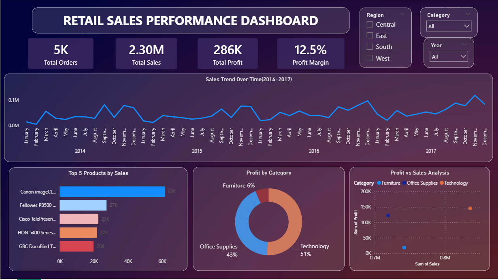

# Retail-Sales-Performance-Dashboard
As a first-year BSc Data Science student, I built this dashboard during my summer vacation to strengthen my data analytics skills.

## Dashboard Preview

## Project Overview
 
*This project presents an interactive Power BI dashboard analyzing retail sales data.*

## Objective
The goal of this project is to analyze sales performance, profitability, and regional trends to support data-driven decision-making.

## Dataset
The dataset includes:

Sales and Profit data

Order details

Product categories

Regional information

## Key Insights

**Sales** show consistent growth from **2014 to 2017**

**Technology category** generates highest **profit**

**Top 5 products** contribute major **revenue**

## Features

*KPI Cards (Sales, Profit, Orders, Profit Margin)*

*Sales Trend Analysis*

*Category-wise Profit Distribution*

*Interactive Filters (Region, Category, Year)*

## Tools Used

*Power BI*

*Excel*
## How to use
Download the PBIX file

Open it in Power BI Desktop

Explore the dashboard using filters and visuals
## Files included 
Retail_Sales_Dashboard.pbix

dashboard.png
